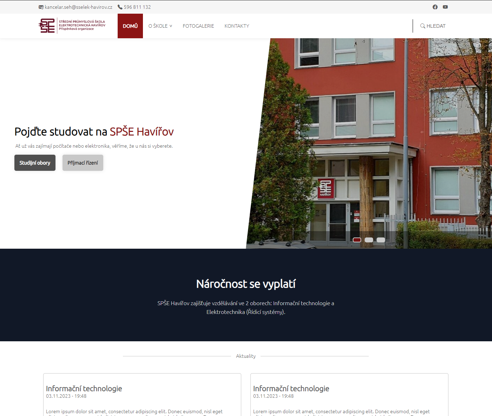
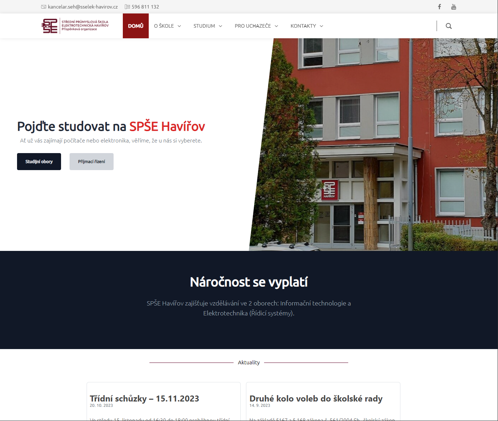

# Project for VIA (Web Page recode)

    
    

- Author: Pavel Mikula (MIK0486)
- Took approximately 12 hours

## Project Theme
This project is recode of any public website I could choose. Page chosen is my high school [website](https://www.spsehavirov.cz/).
Aim of this project is to recode the website by our skills and knowledge. By following the
requirements, we should create a website that will be as similar as possible to the original one.

## Requirements:
- [ ] Multi-column layout of page content
- [ ] Main menu including dynamic submenu
- [ ] Content or image slider/carousel (according to graphic design)
- [ ] List of articles with links to the article details
- [ ] Contact form with validation (at least HTML 5 and styling)
- [ ] Photo gallery with dynamic display of photos (enlarging a photo from the gallery)
- [ ] Counter/timer (up to a certain number or based on a date) - custom JavaScript without using a third-party library!
- [ ] Responsive behavior of the web presentation
- [ ] Additional elements based on content needs or chosen design

## Images
Example maze output:

     
    &nbsp;
    &nbsp;
    &nbsp;
     

## Attention
**This project is used only for educational purposes. All rights reserved to their respective owners.**
Original website can be found [here](https://www.spsehavirov.cz/).